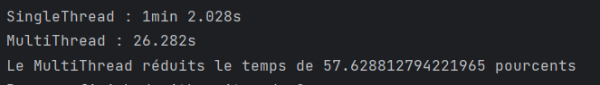

## Image resize perf test

Le but de ce projet est de comparer les performances singleThread vs multiThread dans le cas de la redimension d'images.
Cette application java utilise la librairie Graphics2D pour redimensionner les images.

On fournit en entrée un répertoire contenant des images.
Les images sont converties en JPG et 100x100 pixels.

Le multithreading est possible car le traitement d'une image ne nécessite pas le résultat du traitement de l'image précédente.
Il est donc possible de traiter toutes les images en parallèle et gagner en temps de traitement

Voici les résultats de benchmark effectué avec 200 images jpg
